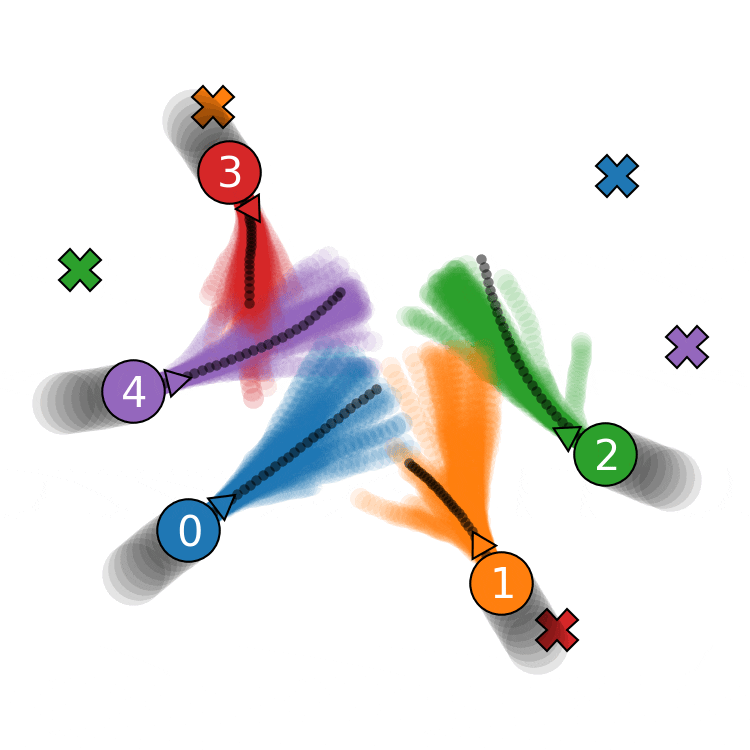
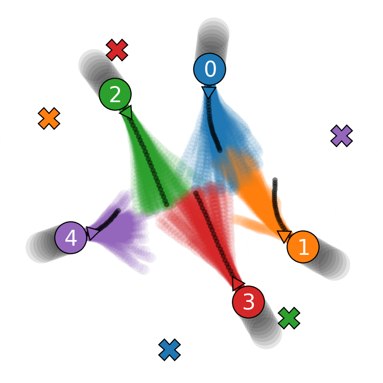

# Inverse Mixed Strategy Games with Generative Trajectory Models

Authors: Max Muchen Sun, Pete Trautman, Todd Murphey

  
  

This repository contains the implementation for the paper "Inverse Mixed Strategy Games with Generative Trajectory Models" ([PDF](https://arxiv.org/abs/2502.03356)), which will be presented at 2025 International Conference on Robotics and Automation (ICRA). 

In this work, we propose an inverse game method that integrates a generative trajectory model into a differentiable mixed-strategy game framework--Bayesian Recursive Nash Equilibrium (BRNE). By representing the mixed strategy with a conditional variational autoencoder (CVAE), our method can infer high-dimensional, multi-modal behavior distributions from noisy measurements while adapting in real-time to new observations. More information (including tutorials) on BRNE can be found at this [indepedent repository](https://github.com/MurpheyLab/brne).

This repository contains the following:
- [`dataset_generation.py`](./dataset_generation.py): The script to generate synthetic multi-agent dataset using [iLQGames](https://arxiv.org/abs/1909.04694), which uses the utitlity functions in [`dynax.py`](./dynax.py). We also include the pre-generated dataset in `synthetic_dataset_5agents.zip`.
- [`inverse_mixed_strategy.ipynb`](./inverse_mixed_strategy.ipynb): This notebook contains all the steps for training the CVAE model and solving the inverse game with BRNE. We also provide the pre-trained weights for the CVAE (`cva`e_5agent`s(./dynax.py).pkl`) and the MLP-based risk/interaction function (`risk_mlp_5agents.pkl`).

Contact: Please contact Max Muchen Sun (msun@u.northwestern.edu) if you have any question.
